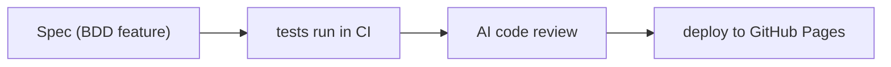

# test_ai_workflow

A Kanban-style project board that ships via a fully automated AI-assisted delivery pipeline.

## About the App

TrelloLite is a lightweight Kanban board that runs entirely in the browser. You can organise work across multiple lists, create and rename cards, attach labels and due dates to cards, drag cards between columns, and filter by label or search term. All board data persists in `localStorage` so the board survives a page reload without a backend.

Key concepts:

- **List** — a column on the board (e.g. To Do, In Progress, Done).
- **Card** — a task within a list; can have a title, description, label, and due date.
- **Label** — a colour tag on a card used for filtering and visual grouping.
- **Due date** — a deadline shown on the card; overdue cards are highlighted automatically.

## Delivery Pipeline

Features are built by AI and shipped through deterministic CI: the pipeline decides pass or fail based on BDD specs that were written before any implementation exists.

See the full slide deck: [docs/pipeline-deck.html](docs/pipeline-deck.html)

### How it works

1. **Spec** — a `.feature` file captures the desired behaviour before any code is written.
2. **tests** — pytest-bdd runs the scenarios deterministically; the pipeline decides pass or fail.
3. **review** — an AI implementer writes the code; a reviewer checks it.
4. **deploy** — once tests pass the site is deployed to GitHub Pages automatically.
