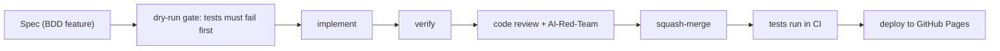

# test_ai_workflow

A Kanban-style project board that ships via a fully automated AI-assisted delivery pipeline.

## Delivery Pipeline

Features are built by AI and shipped through deterministic CI: the pipeline decides pass or fail based on BDD specs that were written before any implementation exists.

See the full slide deck: [docs/pipeline-deck.html](docs/pipeline-deck.html)

### How it works

1. **Spec** — a `.feature` file captures the desired behaviour before any code is written.
2. **dry-run gate** — the pipeline runs tests first; they must fail to prove the spec is genuine before implementation starts.
3. **implement** — an AI implementer writes the code to satisfy the spec.
4. **verify** — the implementation is verified against the spec scenarios.
5. **code review + AI-Red-Team** — an AI-Red-Team reviews for security and correctness; a human reviewer checks the code.
6. **squash-merge** — approved changes are squash-merged into main.
7. **tests** — pytest-bdd runs the scenarios deterministically; the pipeline decides pass or fail.
8. **deploy** — once tests pass the site is deployed to GitHub Pages automatically.
